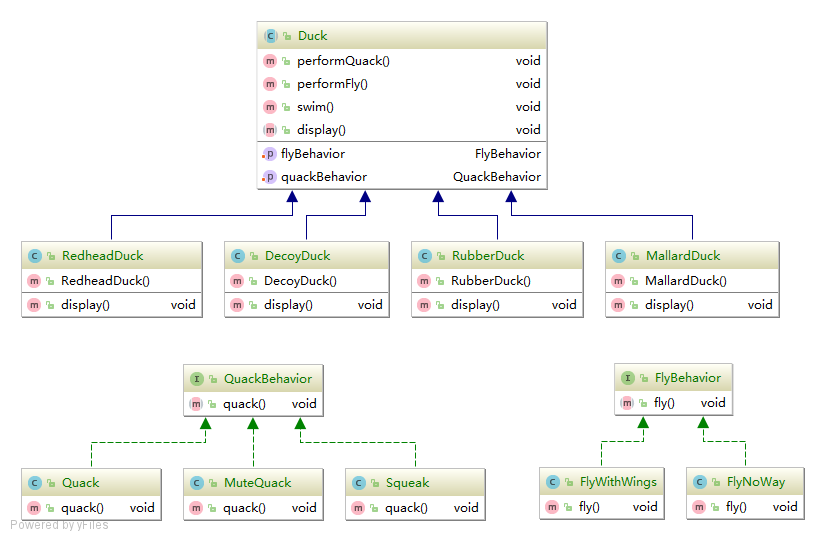
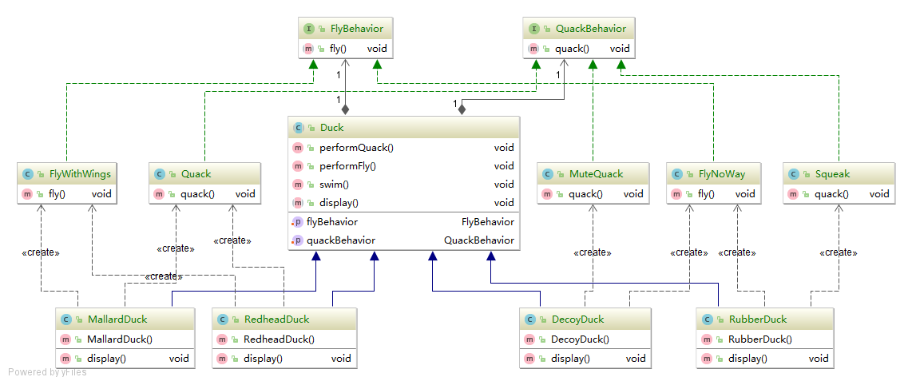
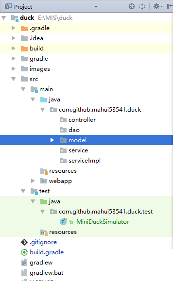
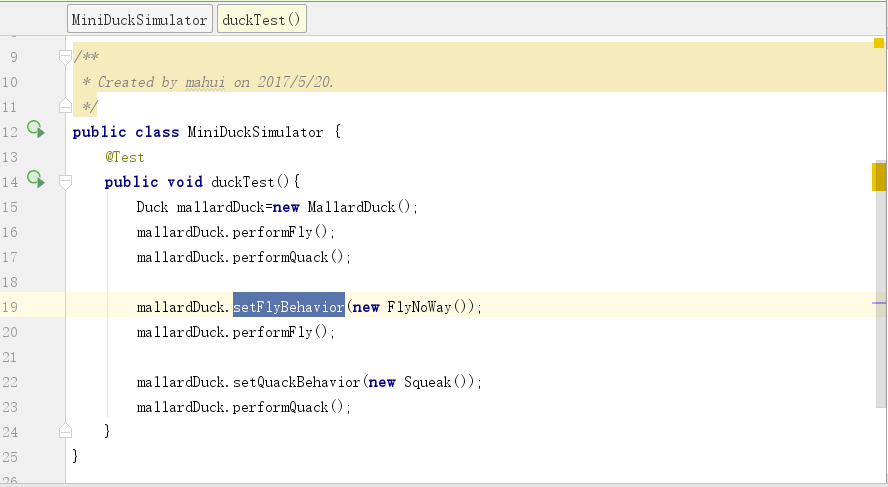
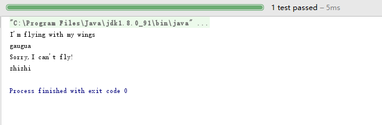

# duck
Design Pattern

  ##### IDE
  Eclipse确实强大，但 **Intellij Idea** 更智能，强烈推荐 **Idea**（学生可以免费使用一年）
  
  ##### 依赖管理工具
  
  `Gradle`
 
  ## 以下是类图：
  
  
  ### 简单类图
  
  
  ### 详细类图（加入依赖关系）
  
  
  
  ## 目录结构
  
  
  
  ## 测试程序及结果
  
   ### 测试代码
   
   
   
   ### 运行结果
   
   
  ## 开源许可证
   MIT

